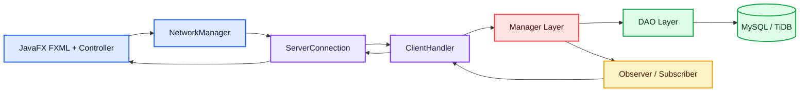

# SnowFox - Hệ Thống Đấu Giá Trực Tuyến

<p align="center">
  
</p>

<p align="center">
  <b>Ứng dụng desktop đấu giá trực tuyến dùng JavaFX, Java Socket Server và MySQL/TiDB.</b>
</p>

<p align="center">
  
  
  
  
  
</p>

## Mục Lục

- [1. Tổng quan](#1-tổng-quan)
- [2. Kiến trúc](#2-kiến-trúc)
- [3. Chức năng chính](#3-chức-năng-chính)
- [4. Cấu trúc dự án](#4-cấu-trúc-dự-án)
- [5. Cách chạy](#5-cách-chạy)
- [6. Build, test và kiểm tra mã nguồn](#6-build-test-và-kiểm-tra-mã-nguồn)

---

## 1. Tổng quan

SnowFox là ứng dụng JavaFX theo mô hình client-server. Client chịu trách nhiệm giao diện và gửi request qua socket. Server nhận `Command`, xử lý nghiệp vụ, truy cập database qua DAO rồi trả về `Response`.

Trong mã nguồn hiện có 2 loại tài khoản:

| Vai trò | Ý nghĩa |
| --- | --- |
| `USER` | Người dùng thường, vừa có thể tạo phiên đấu giá như seller vừa có thể tham gia đặt giá như bidder. |
| `ADMIN` | Quản trị viên, quản lý tài khoản và phiên đấu giá. |

Các trạng thái phiên đấu giá đang được định nghĩa trong `AuctionStatus`:

```text
NOT_START, RUNNING, CLOSED, CANCELLED, PAID, CANCELLED_BY_ADMIN
```

Các loại sản phẩm đang được định nghĩa trong `ItemCategory`:

```text
ELECTRONICS, ART, VEHICLE, OTHER
```

---

## 2. Kiến trúc



| Tầng | Thành phần chính |
| --- | --- |
| Client UI | FXML, CSS, controller trong `src/main/java/com/javfxtutorial/hethongdaugia/client/controller`. |
| Client network | `NetworkManager`, `ServerConnection`, `ResponseListener`. |
| Common | `Command`, `Response`, model domain, enum, exception dùng chung. |
| Server network | `ServerApp`, `ClientHandler`, `BidListener`, `ClientHandlerContextHolder`. |
| Server business | `AuctionManager`, `UserManager`, `PasswordHasher`. |
| Data access | `UserDAO`, `ItemDAO`, `AuctionDAO`, `BidDAO`, `ParticipatedAuctionDAO`, `NotificationDAO`, `JDBCUtil`. |

Luồng chính:

1. Client gửi object kế thừa `Command` qua `ObjectOutputStream`.
2. `ClientHandler` nhận command, gọi `cmd.handle()`.
3. Command gọi manager hoặc DAO tương ứng.
4. Server trả `Response` về client.
5. Với bid realtime, server dùng `BidListener` và broadcast qua các `ClientHandler` đang theo dõi phiên.

---

## 3. Chức năng chính

| Nhóm | Hiện thực trong mã nguồn |
| --- | --- |
| Đăng ký, đăng nhập | `RegisterController`, `LoginController`, `AddAccountCommand`, `LoginCommand`, `UserManager`. |
| Mật khẩu | `PasswordHasher` dùng PBKDF2-HMAC-SHA256, salt 16 bytes, 120000 iterations. |
| Cập nhật hồ sơ, reset mật khẩu | `UpdateProfileCommand`, `ResetPassWordCommand`, `UserProfileController`, `AdminUpdateController`, `PasswordResetController`. |
| Quản lý user cho admin | `AdminUserController`, `Admin_UpdateUserInfo.fxml`, `DeleteUserCommand`, `GetAllUsersCommand`. |
| Quản lý auction cho admin | `AdminItemController`, `Admin_ProductManagement.fxml`, `GetAllAuctionsCommand`, `UpdateAuctionStatusCommand`. |
| Seller tạo/sửa/xóa auction | `SellerManagementController`, `AddAuctionCommand`, `UpdateAuctionCommand`, `DeleteAuctionCommand`. |
| Sản phẩm theo loại | `Item`, `Art`, `Electronics`, `Vehicle`, các factory trong `common/model/factory`. |
| Danh sách và lọc auction | `AuctionListController` dùng search, lọc trạng thái và lọc loại sản phẩm. |
| Tham gia đấu giá | `LiveAuctionController`, `PlaceBidCommand`, `AuctionManager.placeBid()`, `BidDAO`. |
| Lịch sử bid và biểu đồ | `GetBidHistoryCommand`, `BidTransactionCell`, `LineChart` trong `LiveAuction.fxml`. |
| AutoBid | `AutoBidConfig`, `AutoBidCommand`, `AuctionManager.registerAutoBid()`. |
| Anti-snipe | `AntiSnipeExtender`; nếu bid nằm trong 60 giây cuối thì gia hạn thêm 60 giây. |
| Thanh toán mô phỏng | `PaymentPopupController`, `GetUnpaidAuctionCommand`, `UpdateAuctionStatusCommand`; trạng thái có `PAID`/`CANCELLED`. |
| Notification seller | `SellerNotification`, `NotificationDAO`, `NotifiCationPopup.fxml`, `NotificationCellPopup.fxml`. |

Các field chính của `Auction`:

```text
auctionId, item, sellerId, initPrice, currentPrice, stepPrice,
winningPrice, startingTime, endingTime, status,
winnerName, winnerEmail, winnerSdt
```

---

## 4. Cấu trúc dự án

```text
Project_SnowFlake/
|-- .github/workflows/ci.yml
|-- .mvn/wrapper/maven-wrapper.properties
|-- config/checkstyle/checkstyle.xml
|-- release/
|   |-- client-app.jar
|   `-- server-app.jar
|-- src/
|   |-- main/
|   |   |-- java/
|   |   |   |-- module-info.java
|   |   |   `-- com/javfxtutorial/hethongdaugia/
|   |   |       |-- client/
|   |   |       |-- common/
|   |   |       `-- server/
|   |   `-- resources/com/javfxtutorial/hethongdaugia/
|   |       |-- assets/
|   |       `-- view/
|   |           |-- css/
|   |           `-- fxml/
|   `-- test/java/com/javfxtutorial/hethongdaugia/
|-- pom.xml
|-- mvnw
|-- mvnw.cmd
|-- qodana.yaml
`-- README.md
```

Entry point:

| Thành phần | Class |
| --- | --- |
| Server socket | `com.javfxtutorial.hethongdaugia.server.ServerApp` |
| Client khi chạy bằng JavaFX Maven Plugin | `com.javfxtutorial.hethongdaugia.client.MainApplication` |
| Client khi chạy JAR | `com.javfxtutorial.hethongdaugia.client.AppLauncher` gọi `MainApp` |

JAR:

| File | Mô tả |
| --- | --- |
| `target/server-app.jar` | Sinh ra sau khi chạy `package`. |
| `target/client-app.jar` | Sinh ra sau khi chạy `package`. |
| `release/server-app.jar` | JAR server đã có sẵn trong repo. |
| `release/client-app.jar` | JAR client đã có sẵn trong repo. |
| `target/HeThongDauGia-1.0-SNAPSHOT.jar` | JAR gốc do Maven tạo, không phải entry chính để chạy app. |

---

## 5. Cách chạy

Yêu cầu:

```text
JDK 25
Maven Wrapper có sẵn trong repo, hoặc Maven cài ngoài nếu muốn build lại JAR
```

Kiểm tra môi trường:

```powershell
java -version
.\mvnw.cmd -version
```

Thứ tự chạy:

```text
1. Chạy server
2. Chạy client
```

### Cách 1: chạy bằng JAR có sẵn trong `release/`

Mở terminal thứ nhất:

```powershell
java -jar release\server-app.jar
```

Mở terminal thứ hai:

```powershell
java -jar release\client-app.jar
```

### Cách 2: build lại JAR rồi chạy

Build:

```powershell
.\mvnw.cmd clean package -DskipTests
```

Mở terminal thứ nhất:

```powershell
java -jar target\server-app.jar
```

Mở terminal thứ hai:

```powershell
java -jar target\client-app.jar
```

### Cách 3: chạy khi phát triển

Chạy server bằng IDE:

```text
com.javfxtutorial.hethongdaugia.server.ServerApp
```

Sau khi server đã chạy, chạy client bằng IDE:

```text
com.javfxtutorial.hethongdaugia.client.MainApplication
```

Hoặc chạy client bằng JavaFX Maven Plugin:

```powershell
.\mvnw.cmd javafx:run
```

Server mặc định lắng nghe ở:

```text
localhost:5000
```

Client đọc host/port server qua system property:

```powershell
java -Dsnowflake.server.host=127.0.0.1 -Dsnowflake.server.port=5000 -jar target\client-app.jar
```

---

## 6. Build, test và kiểm tra mã nguồn

Các lệnh thường dùng:

```powershell
.\mvnw.cmd test
.\mvnw.cmd clean package -DskipTests
.\mvnw.cmd checkstyle:check
.\mvnw.cmd spotless:apply
```

CI trong `.github/workflows/ci.yml` hiện chạy trên Ubuntu, Windows và macOS với Java 25:

```text
mvn install -DskipTests --no-transfer-progress
mvn test -Djava.awt.headless=true --no-transfer-progress
```
