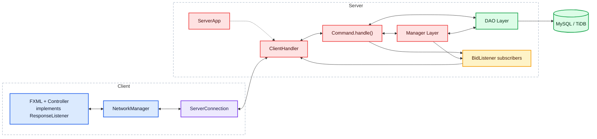

# SnowFox - Hệ Thống Đấu Giá Trực Tuyến

<p align="center">
  
</p>

<p align="center">
  <b>Ứng dụng desktop đấu giá trực tuyến dùng JavaFX, Java Socket Server và MySQL/TiDB.</b>
</p>

<p align="center">
  
  
  
  
  
</p>

## Mục Lục

- [1. Tổng quan](#1-tổng-quan)
- [2. Kiến trúc](#2-kiến-trúc)
- [3. Đối chiếu tiêu chí đánh giá](#3-đối-chiếu-tiêu-chí-đánh-giá)
- [4. Chức năng chính của dự án](#4-chức-năng-chính-của-dự-án)
- [5. Cấu trúc dự án](#5-cấu-trúc-dự-án)
- [6. Cách chạy](#6-cách-chạy)
- [7. Build, test và kiểm tra mã nguồn](#7-build-test-và-kiểm-tra-mã-nguồn)

---

## 1. Tổng quan

SnowFox là ứng dụng JavaFX theo mô hình client-server. Client chịu trách nhiệm giao diện và gửi request qua socket. Server nhận `Command`, xử lý nghiệp vụ, truy cập database qua DAO rồi trả về `Response`.

Trong mã nguồn hiện có 2 loại tài khoản:

| Vai trò | Ý nghĩa |
| --- | --- |
| `USER` | Người dùng thường, vừa có thể tạo phiên đấu giá như seller vừa có thể tham gia đặt giá như bidder. |
| `ADMIN` | Quản trị viên, quản lý tài khoản và phiên đấu giá. |

Phạm vi hệ thống:

| Nhóm | Phạm vi |
| --- | --- |
| Người dùng thường | Đăng ký, đăng nhập, cập nhật hồ sơ, tạo/sửa/xóa phiên đấu giá, tham gia đặt giá, AutoBid, thanh toán mô phỏng. |
| Quản trị viên | Quản lý tài khoản, xem danh sách phiên đấu giá, hủy phiên đấu giá vi phạm. |
| Server | Nhận command qua socket, xử lý nghiệp vụ, đồng bộ bid realtime, lưu dữ liệu. |
| Client | Hiển thị giao diện JavaFX, gửi request và nhận response từ server. |

Các trạng thái phiên đấu giá đang được định nghĩa trong `AuctionStatus`:

```text
NOT_START, RUNNING, CLOSED, CANCELLED, PAID, CANCELLED_BY_ADMIN
```

Các loại sản phẩm đang được định nghĩa trong `ItemCategory`:

```text
ELECTRONICS, ART, VEHICLE, OTHER
```

---

## 2. Kiến trúc



| Tầng | Thành phần chính |
| --- | --- |
| Client UI | FXML, CSS, controller trong `src/main/java/com/javfxtutorial/hethongdaugia/client/controller`; nhiều controller `implements ResponseListener` để nhận `onResponse()`. |
| Client network | `NetworkManager` gửi request và dispatch `Response` về controller; `ServerConnection` giữ socket/ObjectStream. |
| Common command/response | `Command`, `Response`, model domain, enum, exception dùng chung giữa client và server. |
| Server network | `ServerApp` mở `ServerSocket`; mỗi client được xử lý bằng một `ClientHandler` riêng. |
| Server command | `ClientHandler` gọi `Command.handle()`; command gọi manager hoặc DAO tùy nghiệp vụ. |
| Server business | `AuctionManager`, `UserManager`, `PasswordHasher`; realtime bid dùng `BidListener` và subscriber theo `auctionId`. |
| Data access | `UserDAO`, `ItemDAO`, `AuctionDAO`, `BidDAO`, `ParticipatedAuctionDAO`, `NotificationDAO`, `JDBCUtil`. |

Luồng chính:

1. Controller tạo `Command` và gọi `NetworkManager.sendRequest()`.
2. `ServerConnection` gửi command qua socket bằng `ObjectOutputStream`.
3. `ServerApp` accept kết nối, `ClientHandler` đọc command và gọi `cmd.handle()`.
4. Trong `handle()`, command gọi manager hoặc DAO tương ứng rồi tạo `Response`.
5. `ClientHandler` ghi `Response` về socket; `NetworkManager` đọc response và dispatch theo `requestId` hoặc class của command.
6. Với đấu giá realtime, client gửi `RegisterToAuctionCommand`; server lưu `ClientHandler` vào subscriber của `AuctionManager`, sau đó push bid mới qua `BidListener.onPlaceBid()`.

---

## 3. Đối chiếu tiêu chí đánh giá

| Nội dung đánh giá | Trạng thái | Hiện thực trong dự án                                                                                                                                     |
| --- | --- |-----------------------------------------------------------------------------------------------------------------------------------------------------------|
| Xác định và triển khai các lớp chính (`User`, Bidder/Seller/Admin, `Item`, `Auction`, `BidTransaction`,...) | Đã làm | Có `User`, `Item`, `Auction`, `BidTransaction`; vai trò được quản lý bằng `AccountType` với `USER` kiêm bidder/seller và `ADMIN` cho quản trị.            |
| Áp dụng đúng các nguyên tắc OOP | Đã làm | `Item` được kế thừa bởi `Art`, `Electronics`, `Vehicle`; model đóng gói bằng getter/setter; factory, command và interface hỗ trợ đa hình, trừu tượng.     |
| Áp dụng design pattern phù hợp | Đã làm | Có Singleton, Factory Method, Command và Observer.                                                                                                          |
| Quản lý người dùng, sản phẩm | Đã làm | Đăng ký, đăng nhập, cập nhật hồ sơ, reset mật khẩu, quản lý user cho admin; seller tạo/sửa/xóa auction và item.                                           |
| Chức năng đấu giá | Đã làm | Danh sách phiên, chi tiết sản phẩm, tham gia đấu giá trực tiếp, kiểm tra bid hợp lệ, cập nhật người dẫn đầu và trạng thái phiên.                          |
| Xử lý lỗi và ngoại lệ | Đã làm | Có exception cho đăng nhập, user không tồn tại, bid thấp, bid không đủ bước giá, tự bid, phiên chưa bắt đầu/đã đóng, lỗi dữ liệu và lỗi kết nối.          |
| Xử lý đấu giá đồng thời an toàn | Đã làm | `AuctionManager` dùng `ReentrantLock` theo `auctionId`, `ConcurrentHashMap`, `CopyOnWriteArrayList` để giảm race condition khi nhiều client bid cùng lúc. |
| Realtime update bằng Observer/Socket | Đã làm | Server dùng `BidListener` và danh sách subscriber theo `auctionId`, broadcast bid mới qua `ClientHandler` cho các client đang theo dõi phiên.             |
| Thiết kế kiến trúc Client-Server rõ ràng | Đã làm | Client JavaFX gửi `Command` qua socket; server xử lý trong `ServerApp`, `ClientHandler`, manager và DAO rồi trả `Response`.                               |
| Áp dụng MVC | Đã làm | Client tách FXML/CSS, controller và model; server tách command, manager, DAO và domain model.                                                             |
| Sử dụng Maven/Gradle, coding convention tốt, mã nguồn sạch | Đã làm | Có `pom.xml`, Maven Wrapper, Checkstyle, Spotless và cấu hình build JAR client/server.                                                                    |
| Unit Test cho logic quan trọng | Đã làm | Có test JUnit/Mockito cho manager, command, model/factory, exception và password hashing.                                                                 |
| Thiết lập CI/CD cơ bản | Đã làm | Có GitHub Actions trong `.github/workflows/ci.yml` chạy build và test trên Ubuntu, Windows, macOS.                                                        |
| Auto-Bidding | Đã làm | Có `AutoBidConfig`, `AutoBidCommand`, `AuctionManager.registerAutoBid()` và logic so sánh auto-bid theo maxBid/increment/thời điểm đăng ký.               |
| Gia hạn phiên đấu giá khi bid cuối | Đã làm | Có `AntiSnipeExtender`; bid trong 60 giây cuối sẽ gia hạn phiên thêm 60 giây.                                                                             |
| Bid History Visualization | Đã làm | Có `LineChart` trong `LiveAuction.fxml`, cập nhật từ lịch sử bid và bid mới.                                                                              |

---

## 4. Chức năng chính của dự án

| Nhóm chức năng | Thành phần hiện thực |
| --- | --- |
| Đăng ký, đăng nhập | `RegisterController`, `LoginController`, `AddAccountCommand`, `LoginCommand`, `UserManager`. |
| Bảo mật mật khẩu | `PasswordHasher` dùng PBKDF2-HMAC-SHA256, salt 16 bytes, 120000 iterations. |
| Cập nhật hồ sơ, reset mật khẩu | `UpdateProfileCommand`, `ResetPassWordCommand`, `UserProfileController`, `AdminUpdateController`, `PasswordResetController`. |
| Quản lý user cho admin | `AdminUserController`, `Admin_UpdateUserInfo.fxml`, `DeleteUserCommand`, `GetAllUsersCommand`. |
| Quản lý auction cho admin | `AdminItemController`, `Admin_ProductManagement.fxml`, `GetAllAuctionsCommand`, `UpdateAuctionStatusCommand`. |
| Seller tạo/sửa/xóa auction | `SellerManagementController`, `AddAuctionCommand`, `UpdateAuctionCommand`, `DeleteAuctionCommand`. |
| Danh sách và lọc auction | `AuctionListController` dùng search, lọc trạng thái và lọc loại sản phẩm. |
| Đấu giá trực tiếp | `LiveAuctionController`, `PlaceBidCommand`, `AuctionManager.placeBid()`, `BidDAO`. |
| AutoBid và Anti-snipe | `AutoBidConfig`, `AutoBidCommand`, `AntiSnipeExtender`, logic trong `AuctionManager`. |
| Lịch sử bid và biểu đồ giá | `GetBidHistoryCommand`, `BidTransactionCell`, `LineChart` trong `LiveAuction.fxml`. |
| Notification cho seller | `SellerNotification`, `NotificationDAO`, `NotifiCationPopup.fxml`, `NotificationCellPopup.fxml`. |
| Thanh toán mô phỏng | `PaymentPopupController`, `GetUnpaidAuctionCommand`, `UpdateAuctionStatusCommand`. |

Các field chính của `Auction` trong dự án:

```text
auctionId, item, sellerId, initPrice, currentPrice, stepPrice,
winningPrice, startingTime, endingTime, status,
winnerName, winnerEmail, winnerSdt
```

---

## 5. Cấu trúc dự án

```text
Project_SnowFlake/
|-- .github/workflows/ci.yml
|-- .mvn/wrapper/maven-wrapper.properties
|-- config/checkstyle/checkstyle.xml
|-- release/
|   |-- client-app.jar
|   `-- server-app.jar
|-- src/
|   |-- main/
|   |   |-- java/
|   |   |   |-- module-info.java
|   |   |   `-- com/javfxtutorial/hethongdaugia/
|   |   |       |-- client/
|   |   |       |-- common/
|   |   |       `-- server/
|   |   `-- resources/com/javfxtutorial/hethongdaugia/
|   |       |-- assets/
|   |       `-- view/
|   |           |-- css/
|   |           `-- fxml/
|   `-- test/java/com/javfxtutorial/hethongdaugia/
|-- pom.xml
|-- mvnw
|-- mvnw.cmd
|-- qodana.yaml
`-- README.md
```

Entry point:

| Thành phần | Class |
| --- | --- |
| Server socket | `com.javfxtutorial.hethongdaugia.server.ServerApp` |
| Client khi chạy bằng JavaFX Maven Plugin | `com.javfxtutorial.hethongdaugia.client.MainApplication` |
| Client khi chạy JAR | `com.javfxtutorial.hethongdaugia.client.AppLauncher` gọi `MainApp` |

JAR:

| File | Mô tả |
| --- | --- |
| `target/server-app.jar` | Sinh ra sau khi chạy `package`. |
| `target/client-app.jar` | Sinh ra sau khi chạy `package`. |
| `release/server-app.jar` | JAR server đã có sẵn trong repo. |
| `release/client-app.jar` | JAR client đã có sẵn trong repo. |
| `target/HeThongDauGia-1.0-SNAPSHOT.jar` | JAR gốc do Maven tạo, không phải entry chính để chạy app. |

---

## 6. Cách chạy

Công nghệ và môi trường:

| Nhóm | Công nghệ |
| --- | --- |
| Ngôn ngữ | Java 25 |
| Giao diện | JavaFX Controls/FXML 25.0.3 |
| Build | Maven Wrapper 3.8.5 hoặc Maven cài ngoài |
| Database | MySQL/TiDB qua MySQL Connector/J và HikariCP |
| Test | JUnit 5, Mockito, JaCoCo |
| CI | GitHub Actions |

Yêu cầu:

```text
JDK 25
Maven Wrapper có sẵn trong repo, hoặc Maven cài ngoài nếu muốn build lại JAR
```

Kiểm tra môi trường:

```powershell
java -version
.\mvnw.cmd -version
```

Thứ tự chạy:

```text
1. Chạy server
2. Chạy client
```

### Cách 1: chạy bằng JAR có sẵn trong `release/`

Mở terminal thứ nhất:

```powershell
java -jar release\server-app.jar
```

Mở terminal thứ hai:

```powershell
java -jar release\client-app.jar
```

### Cách 2: build lại JAR rồi chạy

Build:

```powershell
.\mvnw.cmd clean package -DskipTests
```

Mở terminal thứ nhất:

```powershell
java -jar target\server-app.jar
```

Mở terminal thứ hai:

```powershell
java -jar target\client-app.jar
```

### Cách 3: chạy khi phát triển

Chạy server bằng IDE:

```text
com.javfxtutorial.hethongdaugia.server.ServerApp
```

Sau khi server đã chạy, chạy client bằng IDE:

```text
com.javfxtutorial.hethongdaugia.client.MainApplication
```

Hoặc chạy client bằng JavaFX Maven Plugin:

```powershell
.\mvnw.cmd javafx:run
```

Server mặc định lắng nghe ở:

```text
localhost:5000
```

Client đọc host/port server qua system property:

```powershell
java -Dsnowflake.server.host=127.0.0.1 -Dsnowflake.server.port=5000 -jar target\client-app.jar
```

---

## 7. Build, test và kiểm tra mã nguồn

Các lệnh thường dùng:

```powershell
.\mvnw.cmd test
.\mvnw.cmd clean package -DskipTests
.\mvnw.cmd checkstyle:check
.\mvnw.cmd spotless:apply
```

CI trong `.github/workflows/ci.yml` hiện chạy trên Ubuntu, Windows và macOS với Java 25:

```text
mvn install -DskipTests --no-transfer-progress
mvn test -Djava.awt.headless=true --no-transfer-progress
```

---

## 8. Tài liệu và liên kết nộp bài

| Nội dung                  | Link                                                                                              |
|---------------------------|---------------------------------------------------------------------------------------------------|
| Báo Cáo                   | [Mở tài liệu](https://drive.google.com/file/d/1o0IBh6RRVxtZIC6QR3hcssDfC_f8ynxJ/view?usp=sharing) |
| Video demo trên GG Driver | [Mở Video](https://drive.google.com/file/d/19xoWSCaqmhOM7LuuLezVFwnwV8Xi2InB/view?usp=sharing)    |
| Video demo trên Youtube   | [Mở Video](https://youtu.be/PQXbnOE3Pjg?si=JszwXo1bJkjY7SIN)                                                                               |
