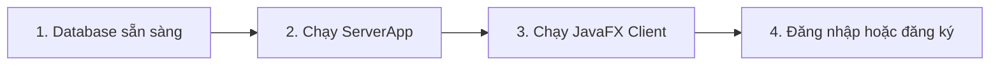

<p align = "center">
<b> Hệ Thống Đấu Giá - SnowFox </b>
</p>
<p align="center">
  
  
  
  
  
</p>

<p align="center">
  <b>Hệ thống đấu giá trực tuyến dạng Client/Server, hỗ trợ quản trị người dùng, quản lý phiên đấu giá, đặt giá trực tiếp và Auto-Bid.</b>
</p>

---

## 1. Mô Tả Bài Toán

Dự án xây dựng một hệ thống đấu giá online cho phép người dùng đăng ký tài khoản, tạo phiên đấu giá cho sản phẩm của mình, tham gia đấu giá sản phẩm của người khác và theo dõi lịch sử đặt giá theo thời gian thực.

Phạm vi hệ thống hiện tại:

| Nhóm | Phạm vi thực tế trong code |
|---|---|
| `USER` | Đăng ký, đăng nhập, cập nhật thông tin cá nhân, tạo/sửa/xóa phiên đấu giá của chính mình khi phiên chưa bắt đầu, xem danh sách phiên đấu giá, đặt giá, bật/tắt Auto-Bid, xem phiên đã tham gia |
| `ADMIN` | Đăng nhập, quản lý tài khoản người dùng, thêm tài khoản, xóa tài khoản, reset mật khẩu, cập nhật thông tin admin, xem danh sách auction/sản phẩm và xóa auction khi còn `NOT_START` |
| `SERVER` | Lắng nghe kết nối socket, nhận command từ client, xử lý nghiệp vụ qua manager/DAO, trả response và broadcast cập nhật phiên đấu giá |


---

## 2. Công Nghệ Và Môi Trường

| Thành phần | Công nghệ sử dụng |
|---|---|
| Ngôn ngữ | Java 25 |
| UI Desktop | JavaFX Controls/FXML 25.0.3 |
| Build tool | Maven Wrapper (`mvnw`, `mvnw.cmd`) |
| Database | MySQL/TiDB Cloud qua MySQL JDBC Driver |
| Giao tiếp Client/Server | Java Socket, ObjectInputStream/ObjectOutputStream, command/response object |
| JSON | `org.json` |
| Logging | SLF4J + Logback |
| Bảo mật mật khẩu | PBKDF2 hash + salt, có cơ chế migrate password plaintext khi đăng nhập thành công |
| Test | JUnit 5, Mockito, JaCoCo, TestFX/JavaFX test |
| CI | GitHub Actions trên Ubuntu/Windows/macOS, Ubuntu chạy JavaFX test qua `xvfb-run` |

Yêu cầu cài đặt:

```bash
Java JDK 25
Maven hoặc Maven Wrapper có sẵn trong repo
MySQL/TiDB database đã cấu hình đúng trong code DAO/config
```

---

## 3. Cấu Trúc Thư Mục Chính

```text
.
|-- .github/workflows/
|   `-- ci.yml                         # CI build/test trên GitHub Actions
|-- .mvn/wrapper/
|   `-- maven-wrapper.jar              # JAR của Maven Wrapper
|-- src/main/java/com/javfxtutorial/hethongdaugia/
|   |-- client/
|   |   |-- MainApplication.java        # Entry point JavaFX Client
|   |   |-- controller/                 # Controller cho Login, Home, Auction, Admin, UI...
|   |   `-- network/                    # Client socket, listener, observer
|   |-- common/
|   |   |-- model/                      # User, Auction, Item, Bid, AutoBid...
|   |   |-- model/Command/              # Command gửi từ Client sang Server
|   |   |-- model/enums/                # AccountType, AuctionStatus, ItemCategory
|   |   |-- network/                    # Command, Response dùng chung
|   |   `-- Exception/                  # Exception theo nhóm auth, bid, data, network...
|   |-- server/
|   |   |-- ServerMain.java             # Entry point Server
|   |   |-- dao/                        # Truy cập database
|   |   |-- manager/                    # Logic nghiệp vụ chính
|   |   |-- network/                    # Server socket, client handler, broadcast
|   |   `-- security/                   # PasswordHasher
|   `-- module-info.java
|-- src/main/resources/com/javfxtutorial/hethongdaugia/view/fxml/
|   |-- login.fxml
|   |-- MainScene.fxml
|   |-- AuctionList.fxml
|   |-- LiveAuction.fxml
|   |-- Seller_ProductManagement.fxml   # Tên file cũ; thực chất là quản lý sản phẩm của USER
|   |-- Admin_UserManagement.fxml
|   `-- Admin_ProductManagement.fxml
|-- src/test/java/
|   |-- client/controller/              # Test UI/controller JavaFX
|   |-- server/manager/                 # Test manager, command contract, model/factory/exception behavior
|   `-- server/security/                # Test PasswordHasher
|-- target/                             # Sinh ra sau khi build/test, không phải source chính
|-- pom.xml
|-- mvnw
|-- mvnw.cmd
`-- README.md
```

---

## 4. Vị Trí Các File `.jar`

| File | Ý nghĩa |
|---|---|
| `.mvn/wrapper/maven-wrapper.jar` | JAR có sẵn của Maven Wrapper, dùng để tải/chạy Maven đúng version |
| `target/HeThongDauGia-1.0-SNAPSHOT.jar` | JAR ứng dụng được sinh ra sau khi chạy `mvn clean package` hoặc `./mvnw clean package` |

Hiện repository không cần commit JAR ứng dụng trong `target/`. Thư mục `target/` là output build và có thể bị xóa/tạo lại bất cứ lúc nào.

---

## 5. Hướng Dẫn Chạy Server/Client

Thứ tự chạy đúng:



### Bước 1: Chuẩn bị database

Đảm bảo MySQL/TiDB đang hoạt động và thông tin kết nối trong code DAO/config khớp với môi trường chạy.

### Bước 2: Chạy Server trước

Entry point server:

```text
com.javfxtutorial.hethongdaugia.server.ServerAp
```

Cách chạy khuyến nghị:

```text
Mở project bằng IDE -> chạy class ServerApp 
```

Server lắng nghe kết nối socket tại:

```text
localhost:5000
```

### Bước 3: Chạy Client sau

Entry point client:

```text
com.javfxtutorial.hethongdaugia.client.MainApplication
```

Chạy bằng Maven Wrapper:

```bash
./mvnw javafx:run
```

Trên Windows:

```powershell
.\mvnw.cmd javafx:run
```

Client cần server chạy trước để gửi command đăng nhập, đăng ký, tải auction, đặt giá và Auto-Bid.

---

## 6. Chức Năng Đã Hoàn Thành

### 6.1. Tài Khoản Và Đăng Nhập

- Đăng ký tài khoản mới với role mặc định là `USER`.
- Đăng nhập theo email/password.
- Điều hướng UI theo role:
  - `USER` vào `MainScene.fxml`.
  - `ADMIN` vào `Admin_UserManagement.fxml`.
- Cập nhật thông tin cá nhân.
- Mật khẩu được lưu bằng PBKDF2 hash thay vì plaintext.
- Nếu gặp password cũ đang là plaintext, hệ thống có thể xác thực rồi migrate sang hash.

### 6.2. Quản Lý Người Dùng Cho Admin

- Xem danh sách tài khoản.
- Tìm kiếm theo ID, email hoặc tên.
- Thêm tài khoản mới.
- Xóa tài khoản.
- Reset mật khẩu người dùng.
- Cập nhật thông tin admin hiện tại.

### 6.3. Danh Sách Auction

- Tải toàn bộ auction từ server.
- Server refresh trạng thái auction trước khi trả response.
- Tìm kiếm auction theo tên sản phẩm.
- Lọc theo trạng thái:
  - `NOT_START`
  - `RUNNING`
  - `CLOSED`
- Lọc theo nhóm sản phẩm:
  - `ART`
  - `VEHICLE`
  - `ELECTRONICS`
  - `OTHER`
- Mở màn chi tiết/live auction từ danh sách.

### 6.4. Quản Lý Sản Phẩm Và Phiên Đấu Giá Của USER

- `USER` có màn quản lý "Sản phẩm của tôi".
- Tạo sản phẩm mới kèm phiên đấu giá.
- Dữ liệu auction gắn với `sellerId` là ID của `USER` hiện tại.
- Xem danh sách auction do chính mình tạo.
- Sửa thông tin sản phẩm/auction khi phiên còn `NOT_START`.
- Xóa auction khi phiên còn `NOT_START`.
- Không cho sửa/xóa khi auction đã bắt đầu hoặc đã kết thúc.

### 6.5. Đặt Giá Trực Tiếp

- Người dùng xem chi tiết phiên đấu giá live.
- Đặt giá thủ công theo bước giá hợp lệ.
- Server kiểm tra auction phải đang `RUNNING`.
- Server kiểm tra giá đặt phải lớn hơn giá hiện tại theo `stepPrice`.
- Lưu lịch sử bid.
- Broadcast cập nhật auction tới các client đang theo dõi.
- UI hiển thị lịch sử bid, giá hiện tại, người dẫn đầu và biểu đồ giá.

### 6.6. Auto-Bid

- Người dùng bật/tắt Auto-Bid cho một auction.
- Auto-Bid lưu giá tối đa và thời điểm đăng ký.
- Khi có bid mới, manager tự tính giá tiếp theo dựa trên `stepPrice`.
- Nếu hai người đặt cùng mức Auto-Bid tối đa, người đăng ký/đang dẫn đầu trước được ưu tiên thắng.
- Trường hợp người đang dẫn đầu có Auto-Bid 300 và người sau bật Auto-Bid 300, giá được đẩy lên 300 và người dẫn đầu cũ vẫn thắng.

### 6.7. Auction Đã Tham Gia

- `USER` xem danh sách các auction mình đã từng tham gia đặt giá.
- Server lấy dữ liệu theo bidder/current user.
- Có kiểm tra trạng thái thanh toán quá hạn để cập nhật auction nếu cần.

### 6.8. Quản Lý Auction/Sản Phẩm Cho Admin

- `ADMIN` xem danh sách auction/sản phẩm trong màn quản lý sản phẩm.
- `ADMIN` có thể xóa auction thông qua server.
- Lệnh xóa vẫn bị ràng buộc bởi logic server: chỉ xóa được auction còn `NOT_START`.
- Code hiện tại không có chức năng admin sửa auction trực tiếp trên màn này.

### 6.9. Test Và CI

- Có test cho manager, command contract, model/factory, exception behavior, PasswordHasher và UI/controller.
- Các test manager dùng mock/stub DAO để kiểm tra logic nghiệp vụ mà không cần database thật.
- JaCoCo đang kiểm tra ngưỡng coverage cho package `server/manager`.
- GitHub Actions chạy test trên:
  - Ubuntu
  - Windows
  - macOS
- Riêng Ubuntu dùng `xvfb-run` để JavaFX test có DISPLAY ảo.
- Một số warning JavaFX/native-access trên Java mới là warning môi trường, không phải lỗi test nếu đã có DISPLAY ảo.

---

## 7. Entry Point Nhanh

| Thành phần | Class/File |
|---|---|
| Server | `src/main/java/com/javfxtutorial/hethongdaugia/server/ServerApp.java` |
| Client | `src/main/java/com/javfxtutorial/hethongdaugia/client/MainApplication.java` |
| Login UI | `src/main/resources/com/javfxtutorial/hethongdaugia/view/fxml/login.fxml` |
| User Home | `src/main/resources/com/javfxtutorial/hethongdaugia/view/fxml/MainScene.fxml` |
| Auction List | `src/main/resources/com/javfxtutorial/hethongdaugia/view/fxml/AuctionList.fxml` |
| Live Auction | `src/main/resources/com/javfxtutorial/hethongdaugia/view/fxml/LiveAuction.fxml` |
| User Product Management | `src/main/resources/com/javfxtutorial/hethongdaugia/view/fxml/Seller_ProductManagement.fxml` |
| Admin User Management | `src/main/resources/com/javfxtutorial/hethongdaugia/view/fxml/Admin_UserManagement.fxml` |
| Admin Product Management | `src/main/resources/com/javfxtutorial/hethongdaugia/view/fxml/Admin_ProductManagement.fxml` |

---

## 8. Trạng Thái Hiện Tại

```text
Architecture : JavaFX Client + Java Socket Server
Roles        : ADMIN, USER
Database     : MySQL/TiDB via JDBC
Password     : PBKDF2 hash
Auction      : Manual Bid + Auto-Bid + Broadcast update
Restriction  : Update/Delete auction chỉ hợp lệ khi NOT_START
CI           : Maven test + JavaFX headless setup trên Ubuntu
```
