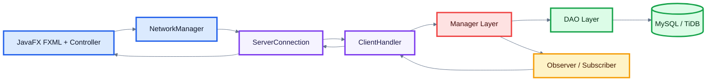

# SnowFox - Hệ Thống Đấu Giá Trực Tuyến

<p align="center">
  
</p>

<p align="center">
  <b>Bài tập lớn Lập trình nâng cao: xây dựng hệ thống đấu giá trực tuyến bằng JavaFX, Java Socket Server và MySQL/TiDB.</b>
</p>

<p align="center">
  
  
  
  
  
</p>

<p align="center">
  
  
  
  
</p>

## Mục Lục

- [1. Giới Thiệu Bài Tập Lớn](#1-giới-thiệu-bài-tập-lớn)
- [2. Mô Tả Hệ Thống](#2-mô-tả-hệ-thống)
- [3. Các Yêu Cầu Cụ Thể](#3-các-yêu-cầu-cụ-thể)
- [4. Đối Chiếu Thang Điểm](#4-đối-chiếu-thang-điểm)

---

## 1. Giới Thiệu Bài Tập Lớn

SnowFox là ứng dụng desktop cho phép người dùng tạo phiên đấu giá, tham gia đặt giá realtime, sử dụng Auto-Bid và theo dõi kết quả phiên đấu giá. Dự án được tổ chức theo mô hình **Client-Server**, trong đó client JavaFX xử lý giao diện, còn server xử lý nghiệp vụ và truy cập database.

<p align="center">
  
  
  
  
</p>

| Nội dung | Mô tả |
| --- | --- |
| Bài toán | Phát triển hệ thống đấu giá trực tuyến cho nhiều người dùng. |
| Mục tiêu | Áp dụng OOP, JavaFX, Socket, xử lý đồng thời, database, unit test và design pattern. |
| Đối tượng sử dụng | `USER` và `ADMIN`. Trong project, `USER` đảm nhiệm cả bidder và seller. |
| Trạng thái | Đã hoàn thành chức năng bắt buộc và một số chức năng nâng cao theo đề bài. |

---

## 2. Mô Tả Hệ Thống

Hệ thống cho phép người bán đăng sản phẩm và mở phiên đấu giá trong một khoảng thời gian nhất định. Người mua đặt giá cao hơn giá hiện tại để cạnh tranh. Server kiểm tra tính hợp lệ của bid, cập nhật người dẫn đầu, lưu lịch sử và thông báo realtime cho các client đang theo dõi cùng phiên.

### 2.1 Phạm vi hệ thống

| Nhóm | Phạm vi |
| --- | --- |
| Người dùng thường | Đăng ký, đăng nhập, cập nhật hồ sơ, tạo/sửa/xóa auction của mình, tham gia đấu giá, đặt giá, Auto-Bid, thanh toán mô phỏng. |
| Quản trị viên | Quản lý user, thêm/xóa tài khoản, reset mật khẩu, cập nhật thông tin admin, quản lý auction. |
| Server | Nhận command qua socket, xử lý nghiệp vụ, đồng bộ bid, broadcast realtime, lưu dữ liệu. |
| Database | Lưu user, item, auction, bid transaction, phiên đã tham gia và notification. |
| Ngoài phạm vi | Web/mobile app, cổng thanh toán thật, vận chuyển hàng hóa, triển khai production. |

### 2.2 Module chính

| Module | Vai trò |
| --- | --- |
| `client` | JavaFX app, controller, model trạng thái client, network manager. |
| `common` | Model, command, response, enum và exception dùng chung. |
| `server` | Socket server, client handler, manager nghiệp vụ, DAO, bảo mật mật khẩu. |
| `resources` | FXML, CSS, ảnh và tài nguyên giao diện. |
| `test` | Unit test cho manager, command, model, exception và password hashing. |

### 2.3 Danh sách chức năng đã hoàn thành

| Chức năng | Trạng thái |
| --- | --- |
| Đăng ký, đăng nhập, phân quyền `USER`/`ADMIN` |  |
| Cập nhật hồ sơ, reset mật khẩu, hash password bằng PBKDF2 |  |
| Admin quản lý user và auction |  |
| Seller tạo, sửa, xóa auction khi phiên chưa bắt đầu |  |
| Hiển thị danh sách, chi tiết, tìm kiếm/lọc auction |  |
| Đặt giá realtime và lưu lịch sử bid |  |
| Tự động cập nhật trạng thái auction |  |
| Thanh toán mô phỏng, trạng thái `PAID`/`CANCELLED` |  |
| Notification cho seller |  |
| Auto-Bid |  |
| Chống bid phút cuối Anti-Sniping |  |
| LineChart lịch sử giá đấu realtime |  |
| Unit test, coverage, CI, Checkstyle, Spotless |  |

---

## 3. Các Yêu Cầu Cụ Thể

### 3.1 Chức Năng Bắt Buộc

<p align="center">
  
  
  
  
</p>

#### 3.1.1 Quản lý người dùng

| Yêu cầu | Hiện thực |
| --- | --- |
| Đăng ký / đăng nhập | `RegisterController`, `LoginController`, `LoginCommand`, `UserManager`. |
| Vai trò Bidder | `USER` tham gia auction, đặt giá, xem lịch sử bid. |
| Vai trò Seller | `USER` tạo/sửa/xóa auction của chính mình. |
| Vai trò Admin | `ADMIN` quản lý user và auction. |
| Bảo mật mật khẩu | `PasswordHasher` dùng PBKDF2 + salt. |

#### 3.1.2 Quản lý sản phẩm đấu giá

| Yêu cầu | Hiện thực |
| --- | --- |
| Thêm / sửa / xóa sản phẩm | `AddAuctionCommand`, `UpdateAuctionCommand`, `DeleteAuctionCommand`. |
| Thông tin sản phẩm | `Item`, `Electronics`, `Art`, `Vehicle`, `Auction`. |
| Giá khởi điểm, giá hiện tại | `startingPrice`, `currentPrice`, `winningPrice`. |
| Thời gian bắt đầu/kết thúc | `startingTime`, `endingTime`, `AuctionStatus`. |

#### 3.1.3 Tham gia đấu giá

| Yêu cầu | Hiện thực |
| --- | --- |
| Đặt giá cao hơn giá hiện tại | Server kiểm tra trong `AuctionManager.placeBid()`. |
| Kiểm tra bid hợp lệ | Kiểm tra trạng thái phiên, bước giá, giới hạn giá và seller tự bid. |
| Cập nhật người dẫn đầu | Cập nhật `winnerId`, `winnerName`, `winningPrice`. |
| Theo dõi realtime | `BidListener`, `ClientHandler`, `LiveAuctionController`. |

#### 3.1.4 Kết thúc phiên đấu giá

| Yêu cầu | Hiện thực |
| --- | --- |
| Tự động đóng phiên khi hết thời gian | `AuctionManager.refreshAuctionStatus()`. |
| Xác định người thắng | Lưu người dẫn đầu trong `Auction`. |
| Chuyển trạng thái phiên | Project dùng `NOT_START -> RUNNING -> CLOSED -> PAID/CANCELLED`. |
| Thanh toán sau khi thắng | `PaymentPopupController`, `UpdateAuctionStatusCommand`. |

#### 3.1.5 Xử lý lỗi và ngoại lệ

| Nhóm lỗi | Hiện thực |
| --- | --- |
| Bid thấp hơn giá hiện tại | `LowerThanCurrentBidException`. |
| Bid không đủ bước giá | `InsufficientIncrementException`. |
| Seller tự bid | `SelfBidException`. |
| Auction chưa bắt đầu / đã đóng | `AuctionNotStartedException`, `AuctionAlreadyEndedException`. |
| Lỗi database / network | `DataException`, `DatabaseConnectionException`, `NetworkException`. |

#### 3.1.6 Giao diện người dùng GUI

| Màn hình | File |
| --- | --- |
| Đăng nhập / đăng ký | `login.fxml`, `SignUp.fxml` |
| Danh sách auction | `AuctionList.fxml`, `AuctionCell.fxml` |
| Chi tiết sản phẩm | `AuctionInformation.fxml` |
| Đấu giá trực tiếp | `LiveAuction.fxml` |
| Quản lý sản phẩm seller | `Seller_ProductManagement.fxml` |
| Quản lý admin | `Admin_UserManagement.fxml`, `Admin_ProductManagement.fxml` |

### 3.2 Chức Năng Nâng Cao

<p align="center">
  
  
  
  
</p>

| Chức năng nâng cao | Hiện thực |
| --- | --- |
| Auto-Bidding | `AutoBidConfig`, `AutoBidCommand`, `AuctionManager.registerAutoBid()`. |
| Concurrent Bidding | `ConcurrentHashMap`, `CopyOnWriteArrayList`, `ReentrantLock` theo `auctionId`. |
| Anti-Sniping | Nếu có bid trong 60 giây cuối, phiên được gia hạn thêm 60 giây. |
| Realtime Update | Observer + Socket, server notify client đang xem cùng auction. |
| Bid History Visualization | `LineChart` trong `LiveAuction.fxml`, cập nhật từ lịch sử bid. |

### 3.3 Thiết Kế Hướng Đối Tượng OOP

| Yêu cầu OOP | Hiện thực |
| --- | --- |
| Lớp chính | `User`, `Item`, `Auction`, `BidTransaction`, `AutoBidConfig`. |
| Kế thừa | `Electronics`, `Art`, `Vehicle` kế thừa `Item`; exception chia theo nhóm kế thừa base exception. |
| Đóng gói | Model dùng field private/protected và getter/setter. |
| Đa hình | Factory tạo item theo category; command xử lý theo type cụ thể. |
| Trừu tượng | DAO interface, command abstraction, listener interface. |

### 3.4 Thiết Kế Kiến Trúc Hệ Thống Networking & MVC



| Thành phần | Vai trò |
| --- | --- |
| Client MVC | FXML là View, controller xử lý sự kiện, `ClientModel` giữ trạng thái. |
| Networking | Java Socket, `ObjectInputStream`, `ObjectOutputStream`, `Command`/`Response`. |
| Server layer | `ClientHandler` nhận command, manager xử lý nghiệp vụ, DAO truy cập database. |
| Database rule | Chỉ server truy cập database. Client không gọi database trực tiếp. |

### 3.5 Tích Hợp Và Triển Khai

#### Công nghệ, môi trường chạy và yêu cầu cài đặt

<p align="center">
  
  
  
  
  
  
</p>

| Nhóm | Công nghệ |
| --- | --- |
| Ngôn ngữ | Java 25 |
| GUI | JavaFX Controls/FXML 25.0.3 |
| Build | Maven 3.9.11 hoặc Maven Wrapper |
| Database | MySQL/TiDB qua MySQL Connector/J 9.3.0 |
| Connection pool | HikariCP 7.0.2 |
| Test | JUnit 5, Mockito, JaCoCo |
| Style | Checkstyle, Spotless |
| CI | GitHub Actions |

Yêu cầu cài đặt:

```text
JDK 25
Maven 3.9.11 hoặc Maven Wrapper
MySQL/TiDB database có schema phù hợp
```

Kiểm tra môi trường:

```powershell
java -version
mvn -version
```

#### Cấu trúc thư mục

```text
Project_SnowFlake/
|-- .github/workflows/ci.yml
|-- .mvn/wrapper/maven-wrapper.jar
|-- config/checkstyle/checkstyle.xml
|-- src/main/java/com/javfxtutorial/hethongdaugia/
|   |-- client/
|   |-- common/
|   `-- server/
|-- src/main/resources/com/javfxtutorial/hethongdaugia/
|   |-- assets/
|   `-- view/
|       |-- css/
|       `-- fxml/
|-- src/test/java/com/javfxtutorial/hethongdaugia/
|-- pom.xml
|-- mvnw
|-- mvnw.cmd
`-- README.md
```

Entry point chính:

| Thành phần | Đường dẫn |
| --- | --- |
| Client JavaFX | `src/main/java/com/javfxtutorial/hethongdaugia/client/MainApplication.java` |
| Server socket | `src/main/java/com/javfxtutorial/hethongdaugia/server/network/ServerApp.java` |
| Quản lý đấu giá | `src/main/java/com/javfxtutorial/hethongdaugia/server/manager/AuctionManager.java` |
| Cấu hình database | `src/main/java/com/javfxtutorial/hethongdaugia/server/dao/JDBCUtil.java` |

#### Vị trí file `.jar`

| File | Vị trí |
| --- | --- |
| JAR ứng dụng | `target/HeThongDauGia-1.0-SNAPSHOT.jar` |
| Maven Wrapper JAR | `.mvn/wrapper/maven-wrapper.jar` |

Tạo lại JAR:

```powershell
mvn package
```

Lưu ý: JAR trong `target/` là build output. Project hiện ưu tiên chạy bằng IDE hoặc Maven JavaFX plugin vì chưa cấu hình runnable fat JAR độc lập.

#### Cấu hình database

`JDBCUtil` đọc cấu hình theo thứ tự: system property, environment variable, default value trong code.

Các biến môi trường chính:

```powershell
$env:SNOWFLAKE_DB_HOST = 'localhost'
$env:SNOWFLAKE_DB_PORT = '3306'
$env:SNOWFLAKE_DB_NAME = 'snowfox'
$env:SNOWFLAKE_DB_USER = 'root'
$env:SNOWFLAKE_DB_PASSWORD = 'your_password'
```

Hoặc dùng JDBC URL:

```powershell
$env:SNOWFLAKE_DB_URL = 'jdbc:mysql://localhost:3306/snowfox?useSSL=false&allowPublicKeyRetrieval=true'
```

#### Hướng dẫn chạy Server/Client theo thứ tự

Thứ tự bắt buộc:

```text
1. Chuẩn bị database
2. Chạy ServerApp
3. Chạy MainApplication
4. Đăng nhập / đăng ký và sử dụng ứng dụng
```

Chạy bằng IDE:

```text
Server:
com.javfxtutorial.hethongdaugia.server.network.ServerApp

Client:
com.javfxtutorial.hethongdaugia.client.MainApplication
```

Chạy client bằng Maven sau khi server đã bật:

```powershell
mvn javafx:run
```

Hoặc dùng Maven Wrapper:

```powershell
.\mvnw.cmd javafx:run
```

Mặc định client kết nối đến:

```text
localhost:5000
```

#### Build, test và style

```powershell
mvn test
mvn verify
mvn checkstyle:check
mvn spotless:apply
```

### 3.6 Design Pattern Áp Dụng

<p align="center">
  
  
  
  
  
</p>

| Pattern | Cách áp dụng |
| --- | --- |
| Singleton | `AuctionManager`, `UserManager`, `ServerConnection`. |
| Factory Method | Tạo item theo category qua các factory. |
| Observer | Server lưu subscriber và notify khi có bid mới. |
| Command | Mỗi request là một command object có `handle()`. |
| DAO | Tách truy cập database khỏi nghiệp vụ. |
| MVC/Layered | FXML/controller/model ở client; handler/manager/DAO ở server. |

---

## 4. Đối Chiếu Thang Điểm

| Nội dung đánh giá | Trạng thái |
| --- | --- |
| Thiết kế lớp và cây kế thừa |  |
| Áp dụng OOP |  |
| Áp dụng design pattern |  |
| Quản lý người dùng, sản phẩm |  |
| Chức năng đấu giá |  |
| Xử lý lỗi và ngoại lệ |  |
| Concurrent bidding |  |
| Realtime update |  |
| Kiến trúc Client-Server |  |
| MVC JavaFX + server layer |  |
| Maven, coding convention |  |
| Unit Test |  |
| CI/CD cơ bản |  |
| Auto-Bidding |  |
| Anti-Sniping |  |
| Bid History Visualization |  |

Kết quả kiểm tra gần nhất:

```text
mvn verify
Tests run: 75, Failures: 0, Errors: 0, Skipped: 0
```
